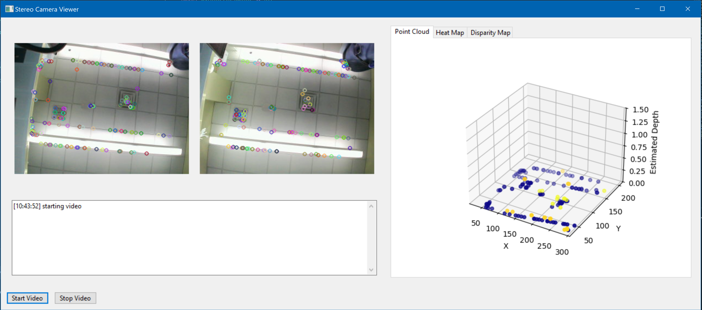
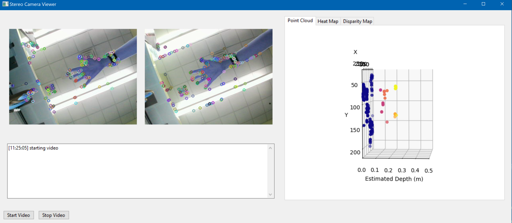
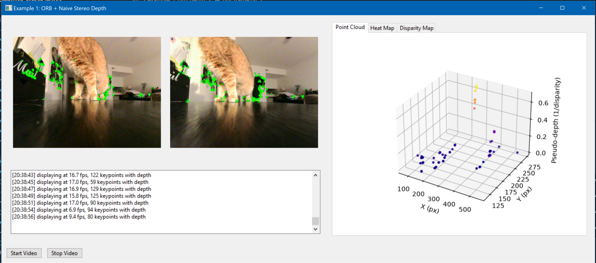
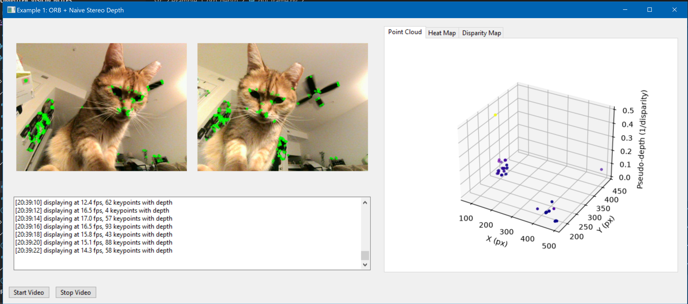
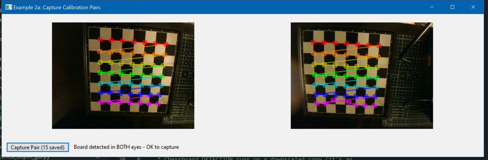
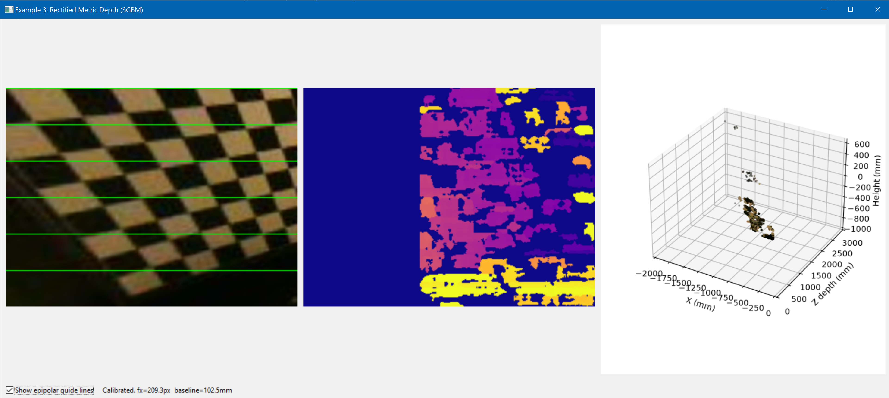
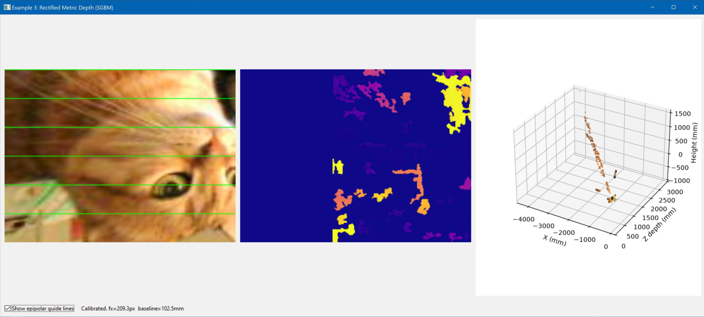
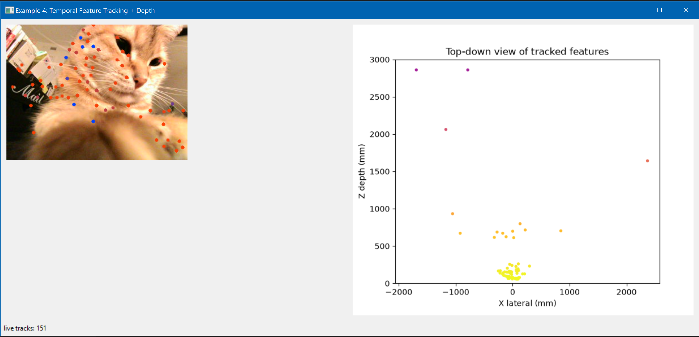

# computer_vision_notes

This repository is a collection of my own notes for a developing side project using a stereo USB camera and depth estimation/object tracking.

I originally took a computer vision course in 2020. For our semester project, we were provided sample RGB video from a camera walked in a large loop around several hallways and asked to reconstruct the path using SLAM mapping. Each frame of the video was approximately 10cm apart. We were allowed to use either MATLAB or Python for the project.

This repository will track project progress and serve as development notes as I work from collecting data myself with the USB camera and working up to SLAM mapping. I plan to include an updated study of how the libraries (in both MATLAB and Python) have changed over the last 5 years and what kind of updates there's been.

This is a fun side project with occasional updates, nothing serious.


## Table of Contents
* [Requirements](#requirements)
* [Equipment](#equipment)
* [Organization](#organization)
* [The Example Progression](#the-example-progression)
* [Shared Code](#shared-code-srccommon)
* [Roadmap](#roadmap)
* [Running](#running)
* [Notes on Units](#notes-on-units)
* [Early Results](#early-results)
* [References](#references)

## Requirements

This was developed using Python 3.12

Use `pip install -r requirements.txt` to install the following dependencies:

```python
contourpy==1.3.3
cycler==0.12.1
fonttools==4.59.2
kiwisolver==1.4.9
matplotlib==3.10.6
numpy==2.2.6
opencv-python==4.12.0.88
packaging==25.0
pillow==11.3.0
pyparsing==3.2.3
python-dateutil==2.9.0.post0
six==1.17.0
wxPython==4.2.3

```

Dependencies can also be installed with:

```python
 pip install wxpython numpy matplotlib opencv-python

```

## Equipment

<p align="center">
        
</p>


The USB Camera was purchased from Amazon as a "4MP Dual Lens USB Camera", the listing is available at: https://www.amazon.com/dp/B0CGXW6ZZK

General technical specs:
* Camera:
    * Sensor: 1/2.7” JX-F35
    * Resolution: 4mp 3840 x 1080
    * Frame Rate: MJPG 60fps@3840x1080
* Lens:
    * Field of View (FOV)： H= 120°
    * Dual synchronization 120degree no distortion lens
    * Focusing Range: 0.33ft (10CM) to infinity

It is advertised with adjustable parameters such as brightness, contrast, saturation, hue, exposure, etc., but these have not yet been explored.


## Organization

The simplified project structure is shown below. The core project lives in
`src`, which contains a series of numbered, standalone examples plus an
`equipment_tests` directory for stand-alone connection/device tests.

```python
.
├── media                               # directory for project media.
│   └── ...                             # imgs, gifs, icons, other small files.
|
├── old_code_temp                       # early prototype code, kept for reference.
│   └── ...                             # original single-file GUI + point cloud demo.
|
├── src                                 # directory for source code of the project.
│   │
│   ├── common                          # utilities shared by all examples.
│   │   ├── stereo_camera.py            # side-by-side USB stereo camera wrapper.
│   │   ├── capture_thread.py           # background capture (keeps UI responsive).
│   │   ├── calibration.py              # loads calibration, rectification, Q matrix.
│   │   └── conversions.py              # OpenCV <-> wx bitmap conversions.
│   │
│   ├── equipment_tests                 # individual equipment tests.
│   │   ├── find_camera.py              # enumerate connected cameras + supported modes.
│   │   └── ...                         # stand-alone connection/device tests.
│   │
│   ├── example_1_orb_depth             # ORB keypoints + naive stereo depth (start here).
│   ├── example_2_calibration           # chessboard capture + stereo calibration.
│   ├── example_3_rectified_depth       # rectification + dense METRIC depth (SGBM).
│   ├── example_4_feature_tracking      # optical flow tracking over time + depth.
│   ├── example_5_visual_odometry       # recovering the camera's own trajectory.
│   └── example_6_local_map             # keyframes + persistent landmarks (pre-SLAM).
|
├── README.md                           # this README.
├── LICENSE                             # a license for usage.
├── .gitignore                          # the repository gitignore file.
└── requirements.txt                    # project requirement minimum.
```

Each example directory has its own README describing what it adds over the
previous one, how to run it, and what to look for. The series is meant to be
read and run in order; examples 3+ expect the calibration file produced by
example 2 (they fall back to an approximate camera model, with a warning,
when it is missing).


## The Example Progression

The examples build from displaying a raw stereo feed all the way to estimating
the camera's own motion and maintaining a small persistent map -- the front-end
of stereo SLAM. Each example is standalone and runnable, but they share
utilities in `src/common/` and later examples consume the calibration file
produced by Example 2.

| Example | Adds | Key OpenCV pieces | Output |
|---|---|---|---|
| `example_1_orb_depth` | Feature detection + naive disparity | `ORB_create`, `StereoBM` | Relative (uncalibrated) depth scatter |
| `example_2_calibration` | Camera + stereo calibration | `findChessboardCorners`, `stereoCalibrate`, `stereoRectify` | `stereo_calibration.npz` (K, D, R, T, Q, baseline) |
| `example_3_rectified_depth` | Rectification + dense metric depth | `initUndistortRectifyMap`, `StereoSGBM`, `reprojectImageTo3D` | True 3D point cloud in mm |
| `example_4_feature_tracking` | Tracking features over **time** | `goodFeaturesToTrack`, `calcOpticalFlowPyrLK` | Depth-colored trails + top-down feature map |
| `example_5_visual_odometry` | Recovering camera motion | `BFMatcher`, triangulation, `solvePnPRansac` | Live top-down trajectory plot |
| `example_6_local_map` | Keyframes + persistent landmarks | keyframe selection, landmark re-observation | Top-down local map alongside the trajectory |

Conceptually: Example 1 matches *across the stereo pair* (gives depth at one
instant), Example 4 matches *across time* (gives motion of points), and Example 5
combines both to ask the inverse question -- if the points didn't move, how did
the *camera* move? Example 6 then stops throwing information away: instead of
treating every frame independently, it keeps keyframes and a persistent set of
landmarks that can be re-observed, which is the data structure a SLAM back-end
operates on. Full SLAM adds that back-end (loop closure, pose graph optimization,
bundle adjustment) on top.


## Shared Code (`src/common/`)

- `stereo_camera.py` -- wraps the side-by-side USB camera (one device, one wide
  frame) and splits it into left/right views.
- `capture_thread.py` -- background capture thread. `VideoCapture.read()` blocks,
  and from Example 3 onward per-frame processing (SGBM, PnP) is heavy enough that
  doing both on the wx UI thread causes stutter and frame-buffer latency. The
  thread keeps only the newest pair; the UI consumes it at its own pace.
- `calibration.py` -- loads `stereo_calibration.npz`, precomputes rectification
  maps, exposes `fx`, `baseline`, and the `Q` matrix. If no calibration file
  exists, examples fall back to an *approximate* model built from the advertised
  120 degree FOV and a guessed baseline -- fine for demos, wrong for measurements.
- `conversions.py` -- the OpenCV <-> wx.Bitmap conversions in one place
  (including correct handling of single-channel images like disparity maps).


## Roadmap

This project builds from raw stereo frames toward SLAM, and eventually toward
robotic vision on a mobile platform. Rough phases:

**Phase 1 -- Stereo vision fundamentals (current)**

| Example | Topic | Status |
|---|---|---|
| 1 | Feature detection + naive disparity depth | done |
| 2 | Stereo calibration (intrinsics, baseline, rectification) | done |
| 3 | Dense metric depth + true 3D point cloud | done |
| 4 | Temporal feature tracking (optical flow) + depth fusion | done |
| 5 | Stereo visual odometry (PnP, trajectory estimation) | sort-of working, needs calibration |
| 6 | Keyframes + persistent local landmark map | in progress, DIY is very buggy |
| 0 | Image filtering fundamentals: smoothing, CLAHE, disparity post-processing | planned |

**Phase 2 -- Toward SLAM**

| Example | Topic | Status |
|---|---|---|
| 7 | Kalman filtering: smoothing tracks and poses (raw vs. filtered) | planned |
| 8 | ArUco fiducial markers: ground-truth poses + measuring VO drift | planned |
| - | Loop closure detection (place recognition, e.g. bag-of-words) | planned |
| - | Pose graph optimization / bundle adjustment (closing the loop) | planned |
| - | Revisit the 2020 hallway-loop course project with live hardware | planned |

**Phase 3 -- Robotic vision**

| Example | Topic | Status |
|---|---|---|
| 9 | Occupancy grid mapping from depth (the map robots navigate with) | planned |
| - | Object detection (cv2.dnn) + depth: semantic 3D localization | planned |
| - | Camera-on-robot integration: mounting, timing, motion blur, exposure | planned |
| - | Library comparison study: OpenCV/Python vs. MATLAB toolboxes, 2020 vs. now | planned |

The dividing idea between phases: Phase 1 asks *"where are things relative to
the camera?"*, Phase 2 asks *"where is the camera, globally and consistently?"*,
and Phase 3 asks *"what should a robot do with that?"*.


## Running

Each example is standalone and runnable. All examples assume the USB camera is
connected at index 0 (not a specific COM port); an alternate index can be
passed as a command-line argument.

Suggested order:

1. Run `src/equipment_tests/find_camera.py` to confirm the camera index and
   supported modes.
2. Run Example 1 to sanity-check the feed and feature detection.
3. Print a 9x6 chessboard and run Example 2 (capture, then calibrate) to
   produce `stereo_calibration.npz`. Sanity-check the reported baseline
   against a ruler.
4. Run Examples 3-6 in order. Each example's README lists what to look for.

The original prototype (a single-file GUI with live POI detection and a naive
depth scatter) is preserved in `old_code_temp/` for reference; it has been
superseded by Example 1.


## Notes on Units

All metric quantities are in the units of the chessboard square size passed to
`calibrate_stereo.py` (default: millimeters). Depth comes from
`Z = fx * baseline / disparity`, so errors in `fx` or the baseline scale every
measurement linearly.


## Early Results

### Original Version
Below are two screenshots of the GUI frame with a live video feed. The two images are the feed from the left and right lenses on the camera with circles representing the detected points of interest (POI). The matplotlib figure on the right is a developing visualization of the points in 3D space with estimated depth.

<p align="center">
        
</p>

<p align="center">
        
</p>

### Example Screenshots

These are pulled from current examples. Most of them need some UI work to make them pretty, but the UI is meant to be simple and demonstrate specific concepts. 

<p align="center">
        
</p>

<p align="center">
        
</p>

<p align="center">
        
</p>

<p align="center">
        
</p>

<p align="center">
        
</p>

<p align="center">
        
</p>


<p align="center">
        
</p>


## References

( in progress)
1. GeeksforGeeks, “OpenCV Tutorial in Python,” GeeksforGeeks, Jan. 30, 2020. https://www.geeksforgeeks.org/python/opencv-python-tutorial/
2. PyPi, “opencv-python,” PyPI, Nov. 21, 2019. https://pypi.org/project/opencv-python/
3. “Du2Net: Learning Depth Estimation from Dual-Cameras and Dual-Pixels,” Github.io, 2025. https://augmentedperception.github.io/du2net/
4. “Depth perception using stereo camera (Python/C++),” Apr. 05, 2021. https://learnopencv.com/depth-perception-using-stereo-camera-python-c/