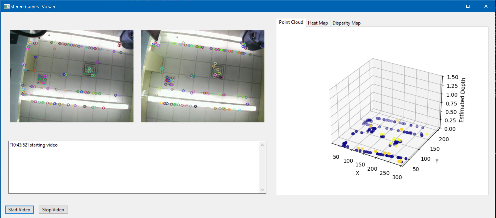

# computer_vision_notes

## UNDER DEVELOPMENT (Please Stand By!)

This repository is a collection of my own notes for a developing side project using a stereo USB camera and depth estimation/object tracking. 

I originally took a computer vision course in 2020. For our semester project, we were provided sample RGB video from a camera walked in a large loop around several hallways and asked to reconstruct the path using SLAM mapping. Each frame of the video was approximately 10cm apart. We were allowed to use either MATLAB or Python for the project.

This repository will track project progress and serve as development notes as I work from collecting data myself from the USB camera and working up to SLAM mapping. I plan to include an updated study for how the libraries (in both MATLAB and Python) have changed over the last 5 years. 


## Table of Contents
* [Requirements](#requirements)
* [Organization](#organization)
* [Running](#running)

## Requirements

This was developed using Python 3.12

Use 'pip install -r requirements.txt' to install the following dependencies:

```python

```

Dependencies can also be installed with:

```python
 pip install wxpython numpy matplotlib opencv-python

```

## Equipment

<p align="center">
        
</p>


The USB Camera was purchased from Amazon as a "4MP Dual Lens USB Camera", the listing is avilable at: https://www.amazon.com/dp/B0CGXW6ZZK 

General technical specs:
* Camera:
    * Sensor: 1/2.7” JX-F35 
    * Resolution: 4mp 3840 x 1080
    * Frame Rate: MJPG 60fps@3840x1080 
* Lens: 
    * Field of View (FOV)： H= 120°
    * Dual synchronization 120degree no distortion lens 
    * Focusing Range: 0.33ft (10CM) to infinity 

It is advertised with adjustable parameters such as brightness, contract, saturation, hue, exposure, etc., but these have not yet been explored. 


## Organization

The simplified project structure is shown below.  Please note that there are both a `src` directory for the core project, and an ` equipment_tests` directory for stand alone testing files. 

```python
.
├── programming_basics_notes
|
├── .docs                               # directory for detailed project documentation.
│   └── ...                             # documentation as PDFs.
|
├── .media                              # directory for project media.
│   └── ...                             # imgs, gifs, icons, other small files.
|
├── .equipment_tests                    # directory for individual equipment tests
│   └── ...                             # stand-alone tests for connection and device operation.
|
├── .src                                # directory for source code of the project.
│   │
│   └── gui_frame.py                    # current project GUI entry point
|
├── README.md                           # this README.
├── LICENSE                             # a license for usage.
├── .gitignore                          # the repository gitignore file.
└── requirements.txt                    # project requirement minimum.
```


## Running

The current program can be run from `gui_frame.py`. It assumes that a USB camera is connected at index 0 (not a specific COM port)


## Early Results

Below are two screenshots of the GUI frame with a live video feed. The two images are the feed from the left and right lenses on the camera with circles representing the detected points of interest (POI). The matplotlib figure on the right is a developing visualization of the points in 3D space with estimated depth. 

<p align="center">
        
</p>

<p align="center">
        
</p>


## References

( in progress)
1. GeeksforGeeks, “OpenCV Tutorial in Python,” GeeksforGeeks, Jan. 30, 2020. https://www.geeksforgeeks.org/python/opencv-python-tutorial/
2. PyPi, “opencv-python,” PyPI, Nov. 21, 2019. https://pypi.org/project/opencv-python/
3. “Du2Net: Learning Depth Estimation from Dual-Cameras and Dual-Pixels,” Github.io, 2025. https://augmentedperception.github.io/du2net/
4. “Depth perception using stereo camera (Python/C++),” Apr. 05, 2021. https://learnopencv.com/depth-perception-using-stereo-camera-python-c/ 


